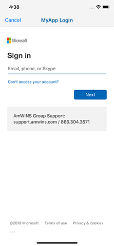

# ti.oauth2

## Ti Alloy Widget for oAuth2

This Widget opens a new Fullscreen Window on top of your current app and takes you to your custom auth url. The Widgets WebView listens for the `code` response to handle the 2 leg-auth and then also listens for your `redirect_url` and upon that load saves your token (if configured) and then executes the onSuccess function where you can control (and close) the Widget.

<br />



# Usage

#### Create Instance

```javascript
var adalWidget = Alloy.createWidget('ti.oauth2');
```

#### Define parameters

```javascript
adalWidget.customServer = true;
adalWidget.customAuthUrl = 'https://yoururl.com/connect/authorize';
adalWidget.customTokenUrl = 'https://yoururl.com/connect/token';
adalWidget.customLogoutUrl = 'https://yoururl.com/connect/session/logout';
adalWidget.customCookieUrl = 'https://yoururl.com/';
adalWidget.clientId = 'clientidhere';
adalWidget.clientSecret = 'secret-guid-would-go-here';
adalWidget.scope = 'scope-one scope-two';
adalWidget.redirectUrl = 'https://redirecturl.com';
adalWidget.responseType = 'code';
adalWidget.grantType = 'authorization_code';
adalWidget.customTitleText = 'My App Login Title';
adalWidget.saveTokensToTiProperties = true; //saves to Ti.App.Properties.getString  ('azure-ad-access-token');
```

#### Launch Login

```javascript
//prompt/show UI   |   success CB  |   error CB    |   allowCancel  |   cancel CB
adalWidget.authorize(true, onSuccess, onError, true, onCancel);
```

#### Success Function

```javascript
function onSuccess(authResults) {
	adalWidget.close();
}
```

<br /><br />

# Methods

## _authorize_

> Open Login Window with the assigned properties (see below)

<br />

## _close_

> Close Login Window

<br /><br />

# Properties configured up front

## _customServer {BOOL}_

> `true` - use your own server (be sure to also define `customAuthUrl` & `customTokenUrl`)  
> `false` - use MS Graph/Azure AD

<br />

## _customAuthUrl {String}_

> URL to use for the initial Auth request

<br />

## _customTokenUrl {String}_

> URL to use for the (2nd leg) Token request

<br />

## _tenant {String)_

> Tenant GUID or Domain

<br />

## _clientId {String}_

> GUID provided by your server

<br />

## _clientSecret {String}_

> GUID provided by your server

<br />

## _scope {String}_

> List of scopes to authorize. Each seperated by a space

<br />

## _redirectUrl {String}_

> URL configured in your server

<br />

## _responseType {String}_

> `code` (default)

<br />

## _grantType {String}_

> `authorization_code` (default)

<br />

## _customTitleText {String}_

> Text to use in the TitleBar of the iOS/Android App

<br />

## _saveTokensToTiProperties {BOOL}_

> `true` - saves the token to Ti Properties so that it is accessible throughout the app and available after restarts

<br /><br />

# Properties passed in w/ .authorize() Method

## _prompt {BOOL}_

> Show UI

<br />

## _onSuccess {Function}_

> Function used in callback for successful authenitcation

<br />

## _onError {Function}_

> Function used in callback for unsuccessful authentication

<br />

## _allowCancel {BOOL}_

> Determines whether to allow the use of Cancel during authentication

<br />

## _onCancel {Function}_

> Function executed, if (allowCancel === true) && user clicks to execute

<br /><br />

# Extra

In my use case, my Identity Server expires my tokens after a period of time. I wanted to capture when my refresh token was going to expire and upon resuming my app, if the expiration time was in the next 10 minutes, I wanted to go ahead and renew the token before the user got into using the app.  
<br />

To accomplish that, in my `onSuccess` function I did the following:

```javascript
function onSuccess(authResults) {
	var secondsToSetExpiration = parseInt(authResults.expires_in) - 600; //subtract 10 minutes
	var expDate = moment().add(secondsToSetExpiration, 'seconds'); //find that timestamp
	Ti.App.Properties.setString('azure-ad-access-token-exp', expDate); //set the time stamp for future reference
}
```

<br />

Then in my `resume` event I check the current time against the expiration time (less 10 minutes)

```javascript
Ti.App.addEventListener('resumed', function (e) {
	Ti.API.info('APP RESUMED');
	var tokenExp = moment(Ti.App.Properties.getString('azure-ad-access-token-exp')).format();
	var currentExp = moment().format();
	if (currentExp > tokenExp) {
		adalWidget.authorize(false, onRefreshSuccess, onRefreshError, true, onRefreshCancel);
	} //else no refresh needed, more than 10 minnutes before expiring
});
```

> _Take Note:_ that my first parameter is set to `false`. This keeps the Auth refresh window "in the background". Also, I have slightly different `onSuccess` and `onError` functions to handle this scenario. Your results may vary.

<br />

I chose to have this Widget pop over the top of my app so that I can inject and use from within anywhere in my app. That also means I have my own "login" screen where I have a button that I use to allow for manual authentication (in cases where network services fail) as well as provide feedback/status to the user ("Authenticating...", "Opening App...",) and on failure back to "Login".

<br />

In my RESTe API Endpoint definitions I added a check for any `401` errors and then execute launching the Widget to re-Auth

```javascript
...
onError: function(e, retry){
    if (e.code === 401) {
        Alloy.PersistentEvents.trigger('app:unauthorizedRequest');
    } else {
        //handle other errors here
    }
}
...
```
